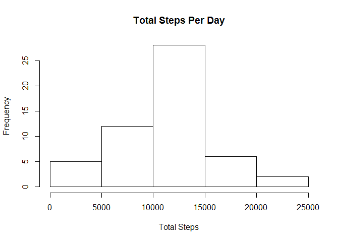
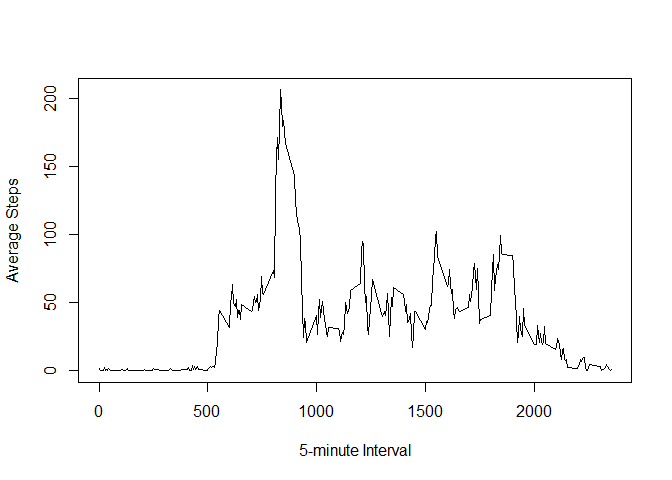
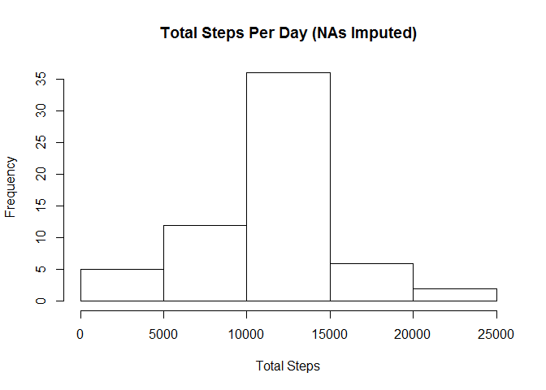
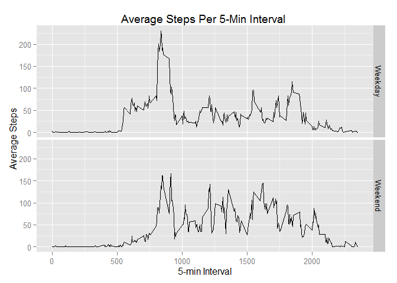

# Reproducible Research: Peer Assessment 1
Melissa Cuaycong  


## Loading and preprocessing the data

```r
activity<-read.csv("./activity/activity.csv", na.strings="NA")
```

## What is mean total number of steps taken per day?

```r
library(plyr)

#Calculate the total steps per day
stepsPD <-ddply(activity,.(date),summarize,
                stepspd = sum(steps))

hist(stepsPD$stepspd,main="Total Steps Per Day",
     xlab="Total Steps",
     ylab="Frequency")
```

 

```r
#Calculate the mean of the total number of steps taken per day.
meanSteps <-format(mean(stepsPD$stepspd,na.rm=TRUE),big.mark=",",scientific=FALSE)
medianSteps <-format(median(stepsPD$stepspd,na.rm=TRUE),big.mark=",",scientific=FALSE)
```

>The MEAN of the total number of steps taken per day is _**10,766.19**_.
The MEDIAN of the total number of steps taken per day is _**10,765**_.

## What is the average daily activity pattern?

```r
#Calculate the average number of steps per interval across all days.
stepsInt <-ddply(activity, .(interval), summarize,
                 meansteps = mean(steps,na.rm=TRUE))

plot(stepsInt$interval,stepsInt$meansteps,type="l",
     xlab="5-minute Interval",
     ylab="Average Steps")
```

 

```r
#Get the max of the average steps per interval.
maxSteps<-format(max(stepsInt$meansteps),big.mark=",",digits=1) 

#Determine which 5-minute interval this maximum occurs.
maxInt<-stepsInt[which.max(stepsInt$meansteps),"interval"]
maxInt<-paste0(trunc(maxInt/100),":",((maxInt/100)-trunc(maxInt/100))*100)
```

>On average, across all the days, the maximum steps of _**206**_ occurs in
the 5-minute interval, at  _**8:35**_.

## Imputing missing values


```r
#Calculate and report the total number of missing values in the dataset (i.e. the total
#number of rows with NAs) 

completerows<-complete.cases(activity)
numNArows <-format(table(completerows)["TRUE"],big.mark=",")
```

>There are _**15,264**_ rows with missing values.

Create an adjusted activity dataset with the NA values for number of steps imputed.
Methodology:  Use the average steps for the specific interval (calculated from available data across all days),
   to replace the NA values for the specific interval.
   

```r
#Identify and split missing rows from dataset
narows<-activity[!complete.cases(activity),c("date","interval","steps")]
fullrows<-activity[complete.cases(activity),c("date","interval","steps")]

#Substitute NA values for specific interval with ff methodology 
#- Average steps for the specific interval across all days
newnarows<-merge(x=narows, y=stepsInt, by.x="interval")
newnarows<-newnarows[,c("date","interval","meansteps")]
names(newnarows)[names(newnarows)=="meansteps"] <- "steps"

#Create duplicate dataset with missing values imputed
activityAdj<-rbind(fullrows,newnarows)
```

Next, evaluate the adjusted dataset with the imputed NA values.
Compare findings with the unadjusted dataset.


```r
#Calculate total steps by day for adjusted dataset.
stepsPDA <-ddply(activityAdj,.(date),summarize,
                stepspd = sum(steps))

#Create a histogram
hist(stepsPDA$stepspd, main="Total Steps Per Day (NAs Imputed)",
     xlab="Total Steps",
     ylab="Frequency")
```

 

```r
#Calcualte the mean and median steps for total steps per day.
meanStepsA <-format(mean(stepsPDA$stepspd,na.rm=TRUE), big.mark=",",scientific=FALSE)
medianStepsA <-format(median(stepsPDA$stepspd,na.rm=TRUE),big.mark=",",scientific=FALSE)
```

>The MEAN of the total number of steps taken per day is _**10,766.19**_.
The MEDIAN of the total number of steps taken per day is _**10,766.19**_.
The MEAN and MEDIAN are the same for the adjusted dataset.

###Compare mean/median data between the 2 datasets.

>
Measure       | Activity (NAs)| Activity (NAs imputed)
------------- | ------------- | ----------------------
MEAN          | 10,766.19 | 10,766.19 
MEDIAN        | 10,765|10,766.19


## Are there differences in activity patterns between weekdays and weekends?

Create a factor variable in the adjusted dataset to indicate whether the measurement was taken
on a weekday or a weekend.  Evaluate results.


```r
#Create a flag (factor variable) in the adjusted dataset to indicate weekday or
#weekend #based on the date #measurement was taken
tempday <- weekdays(as.Date(activityAdj$date),abbreviate=TRUE)
activityAdj$dayFlag<-as.factor(ifelse(tempday %in% c("Sat","Sun"),"Weekend","Weekday"))

#Calculate the average steps per interval, grouped by the weekday indicator.
stepsWD <-ddply(activityAdj, .(dayFlag,interval), summarize,
                        meansteps = mean(steps,na.rm=TRUE))

#Plot the results in separate panels by the weekday grouping.

library(ggplot2)
p <- ggplot(stepsWD, aes(interval,meansteps)) 
p <- p +
        geom_line() +
        facet_grid(dayFlag~.) +
        xlab("5-min Interval") +
        ylab("Average Steps") +
        ggtitle("Average Steps Per 5-Min Interval ")
print(p)
```

 

> Weekend activity is, on average slower than Weekday activity. 
Most activity on weekday occurs during the first part of the day, prior to 10 am.  
However, on weekends, also more activity priot to 10 am, but activity is much
more evenly spaced throughout the day.
